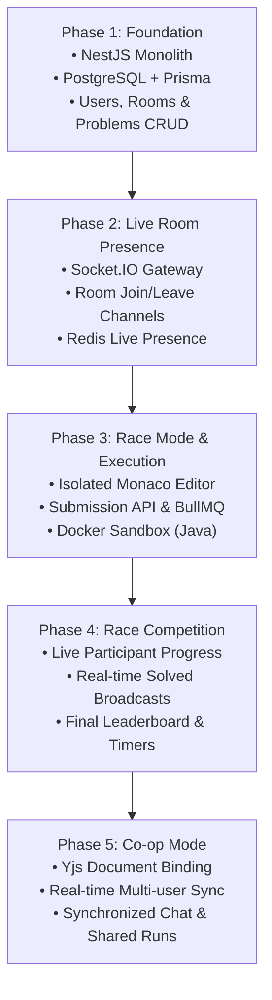

# System Architecture — Collaborative DSA Platform

## 1. Overall Architecture

The platform is architected as a **Modular Monolith** using **NestJS + TypeScript** on the backend and **Angular** on the frontend. This provides high developer velocity, strong architectural boundaries, and real-time collaboration without the operational overhead of microservices.

```
                         ┌─────────────────────┐
                         │   Angular Frontend  │
                         │                     │
                         │ Race Editor         │
                         │ Co-op Editor        │
                         │ Lobby / Results     │
                         └──────────┬──────────┘
                                    │
                  ┌─────────────────┴─────────────────┐
                  │                                   │
              REST API                         WebSocket
                  │                              /Socket.IO
                  ▼                                   ▼
        ┌─────────────────────────────────────────────────┐
        │              Node.js + NestJS Backend           │
        │                                                  │
        │  Auth │ Rooms │ Problems │ Sessions │ Realtime │
        │        Submissions │ Users │ Chat              │
        └──────────────┬───────────────┬──────────────────┘
                       │               │
             ┌─────────┴──────┐   ┌────┴──────────┐
             │                │   │               │
             ▼                ▼   ▼               ▼
       PostgreSQL           Redis             Job Queue
       persistent data      live state         BullMQ
                                               │
                                               ▼
                                      ┌─────────────────┐
                                      │ Execution Worker│
                                      │                 │
                                      │ Docker Sandbox  │
                                      └─────────────────┘
```

### Architectural Principles
- **REST**: Command & queries for static data and user actions (`/rooms`, `/problems`, `/submissions`).
- **Socket.IO**: Bi-directional real-time events, room channel broadcasting, and presence.
- **PostgreSQL (Prisma ORM)**: Authoritative, permanent data store (*"PostgreSQL tells you what happened"*).
- **Redis**: Low-latency temporary & live state store (*"Redis tells you what's happening right now"*).
- **BullMQ + Docker Worker**: Asynchronous queue-based code execution sandbox.
- **Yjs + Monaco**: Conflict-free replicated data type (CRDT) document synchronization for Co-op mode.

---

## 2. Technology Stack

| Layer | Technology | Purpose |
| :--- | :--- | :--- |
| **Frontend** | Angular (v19+) | Standalone components, reactive signals, utility-first CSS |
| **Frontend Editor** | Monaco Editor | Code editor with syntax highlighting and autocompletion |
| **Collaborative Sync** | Yjs + Monaco Binding | CRDT-based concurrent code editing |
| **Backend Runtime** | Node.js + TypeScript | High-performance asynchronous execution |
| **Backend Framework** | NestJS | Structured, modular monolith architecture |
| **API Protocol** | REST + Socket.IO | HTTP request-response & low-latency room event channels |
| **Database** | PostgreSQL | Relational storage for users, rooms, problems, submissions |
| **ORM** | Prisma | Type-safe database client and migrations |
| **Live State & Cache**| Redis | Room presence, active session metadata, socket mappings |
| **Job Queue** | BullMQ | Asynchronous code execution job dispatching |
| **Code Execution** | Docker Sandboxes | Isolated, resource-limited execution containers (Java MVP) |
| **Authentication** | JWT | Stateless token-based user verification |
| **Local Deployment** | Docker Compose | Multi-container local dev (PostgreSQL, Redis, Worker, API) |

---

## 3. NestJS Backend Modular Monolith Structure

Rather than splitting into early microservices, the backend is organized into cleanly bounded NestJS feature modules:

```
apps/api/
├── src/
│   ├── auth/                      # Authentication & JWT strategy
│   │   ├── auth.controller.ts
│   │   ├── auth.service.ts
│   │   ├── auth.module.ts
│   │   └── guards/
│   ├── users/                     # User management & profiles
│   │   ├── users.controller.ts
│   │   ├── users.service.ts
│   │   └── users.module.ts
│   ├── rooms/                     # Room lifecycle, codes, participants
│   │   ├── rooms.controller.ts
│   │   ├── rooms.service.ts
│   │   ├── rooms.gateway.ts       # Socket.IO room event handler
│   │   ├── dto/
│   │   └── rooms.module.ts
│   ├── problems/                  # DSA problem statements, tests, metadata
│   │   ├── problems.controller.ts
│   │   ├── problems.service.ts
│   │   └── problems.module.ts
│   ├── sessions/                  # Race & Co-op session timing and states
│   │   ├── sessions.controller.ts
│   │   ├── sessions.service.ts
│   │   └── sessions.module.ts
│   ├── submissions/               # Submission ingestion, validation, results
│   │   ├── submissions.controller.ts
│   │   ├── submissions.service.ts
│   │   └── submissions.module.ts
│   ├── execution/                 # BullMQ queue producer & execution worker
│   │   ├── execution.service.ts   # Queue producer
│   │   ├── execution.worker.ts    # BullMQ consumer
│   │   └── docker/                # Docker sandbox runner & temp filesystem
│   ├── collaboration/             # Yjs WebSocket server for Co-op editing
│   │   ├── collaboration.gateway.ts
│   │   └── yjs.service.ts
│   ├── chat/                      # Real-time room discussion chat
│   │   ├── chat.controller.ts
│   │   ├── chat.gateway.ts
│   │   └── chat.service.ts
│   ├── realtime/                  # Central Socket.IO server & redis adapter
│   │   └── realtime.module.ts
│   ├── prisma/                    # Prisma service & database bindings
│   │   ├── prisma.service.ts
│   │   └── prisma.module.ts
│   ├── common/                    # Cross-cutting guards, interceptors, filters
│   │   ├── guards/
│   │   ├── filters/
│   │   ├── interceptors/
│   │   └── decorators/
│   ├── app.module.ts
│   └── main.ts
├── prisma/
│   └── schema.prisma              # Prisma schema definition
├── Dockerfile
└── docker-compose.yml
```

---

## 4. Room & Presence Architecture

The `Room` is the central aggregate root of the application.

```
Room: ABC123
Host: Teja
Mode: RACE
Problem: Dijkstra
Participants: [Teja, Rahul, Ankit, Priya]
```

### Joining Flow
```
Client
   │
   │ POST /api/rooms/:code/join
   ▼
NestJS API
   │
   ├── 1. Validate room exists & is open
   ├── 2. Add participant record (PostgreSQL)
   └── 3. Cache participant in Redis (room:ABC123:participants)
           │
           ▼
Client receives room payload & connects to Socket.IO
   │
   │ socket.emit('room:join', { roomCode: 'ABC123' })
   ▼
Socket.IO Gateway
   │
   ├── socket.join('room:ABC123')
   └── socket.to('room:ABC123').emit('room:user_joined', { userId, username })
```

---

## 5. 🏁 Race Mode Architecture & Submission Pipeline

In Race Mode, each participant solves independently in an isolated Monaco editor buffer. Code content is **never** shared across the wire during a race. The backend only broadcasts metadata.

### 5.1 Privacy Principle
```
             Dijkstra Problem
                    │
       ┌────────────┼────────────┐
       ▼            ▼            ▼
     Teja          Rahul        Ankit
   (Private)     (Private)    (Private)
```
- Opponents see:
  - `Rahul`: 🟡 Solving (Attempt 2)
  - `Ankit`: 🟢 Solved (04:12)
  - `Priya`: 🟡 Solving (Attempt 1)
- Source code remains completely private until session conclusion.

### 5.2 Asynchronous BullMQ Execution Pipeline

Code is never compiled or executed directly inside the HTTP request handler. Instead, requests enter an asynchronous BullMQ queue:

```
             User clicks SUBMIT
                     │
                     ▼
              Angular Client
                     │
                     │ POST /api/sessions/:id/submissions
                     ▼
              NestJS API
                     │
                     ├── 1. Validate session is ACTIVE
                     ├── 2. Save Submission (Status: QUEUED in PostgreSQL)
                     └── 3. Dispatch Job to BullMQ ("executionQueue")
                             │
                             ▼
                         BullMQ
                         Job Queue
                             │
                             ▼
                     Execution Worker
                             │
                             ▼
                       Docker Sandbox
                             │
                    ┌────────┴─────────┐
                    │                  │
                 Compile            Execute
                    │                  │
                    └────────┬─────────┘
                             ▼
                          Result
                             │
                             ▼
                      NestJS Backend
                             │
                    ┌────────┴─────────┐
                    ▼                  ▼
               PostgreSQL           Socket.IO
             Update Status         room:ABC123
             (ACCEPTED/FAILED)         │
                                       ▼
                             Broadcast race:user_solved
                             or race:user_submitted
```

### 5.3 Docker Execution Sandbox Security

Code is executed within isolated, ephemeral Docker containers with strict safety policies:
- **Language**: Java initially for the MVP (`openjdk:17-alpine`).
- **CPU Limit**: Max 1 core per job (`--cpus=1.0`).
- **Memory Ceiling**: Capped at 256MB (`--memory=256m`).
- **Timeout**: Strict 2.5s wall-clock limit (`timeout 2.5s java ...`).
- **Network**: Completely disabled (`--network none`).
- **Filesystem**: Read-only root with transient tmpfs mount (`--tmpfs /tmp:rw,noexec,nosuid`).
- **Lifecycle**:
  1. Worker creates unique temp directory on host.
  2. Writes user code (`Solution.java`) and test runner harness.
  3. Spins up Docker container executing compile and run.
  4. Collects stdout, stderr, execution time, and memory usage.
  5. Cleans up temp directory and terminates container.

---

## 6. 🤝 Co-op Mode Architecture (Yjs + Monaco)

Co-op mode is collaborative pair programming where all participants edit a shared codebase in real time.

```
             Yjs Document (CRDT)
                      │
           ┌──────────┼──────────┐
           ▼          ▼          ▼
         Teja       Rahul      Ankit
           │          │          │
           └──────────┼──────────┘
                      │
               Collaboration Server
                  (Yjs Gateway)
                      │
                      ▼
                    Redis
```

### Conflict Resolution via CRDT
- Simply broadcasting text changes on every keystroke causes merge conflicts, cursor jumping, and data loss under concurrent typing.
- The platform uses **Yjs** with the **y-monaco** binding:
  - Document mutations are processed as conflict-free commutative CRDT operations.
  - State vectors are synchronized through the NestJS collaboration gateway backed by Redis pub/sub.
  - Provides seamless concurrent multi-user editing with cursor preservation.
- Shared code runs can be triggered by any participant; the output is multicast to all room members simultaneously.
- Synchronized chat channel runs side-by-side with the editor.

---

## 7. State Storage: PostgreSQL vs. Redis

| Store | Scope | Responsibility | Key Entities / Keys |
| :--- | :--- | :--- | :--- |
| **PostgreSQL** | Permanent Data | Records history and authoritative state (*"What happened"*) | `Users`, `Rooms`, `RoomParticipants`, `Problems`, `TestCases`, `Sessions`, `Submissions`, `ChatMessages` |
| **Redis** | Live / Ephemeral State | Real-time presence, locks, active session countdowns (*"What is happening right now"*) | `room:<code` (metadata, participants, mode)<br>`session:<id>` (start time, status, clock)<br>`presence:user:<id>` (socketId, online status) |

---

## 8. Database Design (Prisma / PostgreSQL Schema)

```
             USERS
               │
               │ 1:N
               ▼
       ROOM_PARTICIPANTS
               │
               │ N:1
               ▼
             ROOMS
            /     \
       N:1 /       \ 1:N
          ▼         ▼
      PROBLEMS    SESSIONS
                    │
                    │ 1:N
                    ▼
               SUBMISSIONS
                    │
                    ▼
              EXECUTION RESULTS

ROOM ─── 1:N ─── CHAT_MESSAGES
PROBLEM ─ 1:N ── TEST_CASES
```

### Prisma Schema Definition (`prisma/schema.prisma`)

```prisma
datasource db {
  provider = "postgresql"
  url      = env("DATABASE_URL")
}

generator client {
  provider = "prisma-client-js"
}

enum RoomMode {
  RACE
  COOP
}

enum RoomStatus {
  WAITING
  ACTIVE
  COMPLETED
}

enum SessionStatus {
  WAITING
  COUNTDOWN
  ACTIVE
  COMPLETED
}

enum SubmissionStatus {
  SUBMITTED
  QUEUED
  RUNNING
  ACCEPTED
  WRONG_ANSWER
  TIME_LIMIT_EXCEEDED
  RUNTIME_ERROR
  COMPILE_ERROR
}

enum Difficulty {
  EASY
  MEDIUM
  HARD
}

model User {
  id           String            @id @default(uuid())
  username     String            @unique
  createdAt    DateTime          @default(now()) @map("created_at")
  roomsHosted  Room[]            @relation("HostedRooms")
  participants RoomParticipant[]
  submissions  Submission[]
  messages     ChatMessage[]

  @@map("users")
}

model Room {
  id           String            @id @default(uuid())
  code         String            @unique
  name         String?
  mode         RoomMode          @default(RACE)
  hostUserId   String            @map("host_user_id")
  hostUser     User              @relation("HostedRooms", fields: [hostUserId], references: [id])
  problemId    String?           @map("problem_id")
  problem      Problem?          @relation(fields: [problemId], references: [id])
  status       RoomStatus        @default(WAITING)
  createdAt    DateTime          @default(now()) @map("created_at")
  startedAt    DateTime?         @map("started_at")
  endedAt      DateTime?         @map("ended_at")

  participants RoomParticipant[]
  sessions     Session[]
  chatMessages ChatMessage[]

  @@map("rooms")
}

model RoomParticipant {
  id        String    @id @default(uuid())
  roomId    String    @map("room_id")
  room      Room      @relation(fields: [roomId], references: [id], onDelete: Cascade)
  userId    String    @map("user_id")
  user      User      @relation(fields: [userId], references: [id], onDelete: Cascade)
  joinedAt  DateTime  @default(now()) @map("joined_at")
  leftAt    DateTime? @map("left_at")
  status    String    @default("JOINED") // JOINED, READY, LEFT

  @@unique([roomId, userId])
  @@map("room_participants")
}

model Problem {
  id           String      @id @default(uuid())
  title        String
  description  String      @db.Text
  difficulty   Difficulty  @default(EASY)
  constraints  String      @db.Text
  inputFormat  String      @map("input_format") @db.Text
  outputFormat String      @map("output_format") @db.Text
  starterCode  String      @default("") @map("starter_code") @db.Text
  createdAt    DateTime    @default(now()) @map("created_at")

  rooms        Room[]
  testCases    TestCase[]
  submissions  Submission[]

  @@map("problems")
}

model TestCase {
  id             String   @id @default(uuid())
  problemId      String   @map("problem_id")
  problem        Problem  @relation(fields: [problemId], references: [id], onDelete: Cascade)
  input          String   @db.Text
  expectedOutput String   @map("expected_output") @db.Text
  isHidden       Boolean  @default(false) @map("is_hidden")

  @@map("test_cases")
}

model Session {
  id          String        @id @default(uuid())
  roomId      String        @map("room_id")
  room        Room          @relation(fields: [roomId], references: [id], onDelete: Cascade)
  status      SessionStatus @default(WAITING)
  startedAt   DateTime?     @map("started_at")
  endedAt     DateTime?     @map("ended_at")

  submissions Submission[]

  @@map("sessions")
}

model Submission {
  id            String           @id @default(uuid())
  sessionId     String           @map("session_id")
  session       Session          @relation(fields: [sessionId], references: [id], onDelete: Cascade)
  userId        String           @map("user_id")
  user          User             @relation(fields: [userId], references: [id], onDelete: Cascade)
  problemId     String           @map("problem_id")
  problem       Problem          @relation(fields: [problemId], references: [id], onDelete: Cascade)
  code          String           @db.Text
  language      String           @default("JAVA")
  status        SubmissionStatus @default(SUBMITTED)
  executionTime Float?           @map("execution_time") // in milliseconds or seconds
  errorMessage  String?          @map("error_message") @db.Text
  passedTests   Int              @default(0) @map("passed_tests")
  totalTests    Int              @default(0) @map("total_tests")
  createdAt     DateTime         @default(now()) @map("created_at")

  @@map("submissions")
}

model ChatMessage {
  id        String   @id @default(uuid())
  roomId    String   @map("room_id")
  room      Room     @relation(fields: [roomId], references: [id], onDelete: Cascade)
  userId    String   @map("user_id")
  user      User     @relation(fields: [userId], references: [id], onDelete: Cascade)
  message   String   @db.Text
  createdAt DateTime @default(now()) @map("created_at")

  @@map("chat_messages")
}
```

---

## 9. State Machines

### 9.1 Race Session State Machine

```
      WAITING
         │
         │ Host clicks START
         ▼
     COUNTDOWN (3... 2... 1...)
         │
         │ Timer completes
         ▼
      ACTIVE ──────────────┐
         │                 │
         │ All Solved /    │ Time Expires
         ▼                 ▼
             COMPLETED
```

### 9.2 Submission Lifecycle State Machine

```
   SUBMITTED
       │
       ▼
     QUEUED (Added to BullMQ)
       │
       ▼
    RUNNING (Execution inside Docker sandbox)
       │
       ├── ACCEPTED (All test cases passed)
       ├── WRONG_ANSWER (Failed test assertion)
       ├── TIME_LIMIT_EXCEEDED (> 2.5s execution)
       ├── RUNTIME_ERROR (Uncaught exception/crash)
       └── COMPILE_ERROR (Syntax/compilation error)
```

---

## 10. REST API Design

### Room Endpoints
- `POST /api/rooms` — Create room with initial host user and mode (`RACE` or `COOP`).
- `POST /api/rooms/:code/join` — Join an existing room via unique alphanumeric code.
- `GET /api/rooms/:code` — Retrieve current room details, participants, mode, and assigned problem.

### Problem Endpoints
- `GET /api/problems` — List available DSA problems with difficulty and titles.
- `GET /api/problems/:id` — Get detailed problem statement, constraints, and sample test cases.

### Session Endpoints
- `POST /api/sessions/:id/start` — Host starts the session (triggers countdown transition).
- `GET /api/sessions/:id` — Get session status, start time, and active duration.
- `GET /api/sessions/:id/results` — Get final leaderboard, solve times, and ranking summary.

### Submission Endpoints
- `POST /api/sessions/:id/submissions` — Submit code for evaluation:
  ```json
  {
    "language": "JAVA",
    "code": "class Solution { ... }"
  }
  ```
  Returns `202 Accepted` with `{ "submissionId": "...", "status": "QUEUED" }`.
- `GET /api/submissions/:id` — Retrieve submission status and test results.

---

## 11. Socket.IO Event Catalog

| Namespace / Room | Event Name | Direction | Payload Example | Description |
| :--- | :--- | :--- | :--- | :--- |
| `room:{code}` | `room:join` | Client $\rightarrow$ Server | `{ roomCode: "ABC123", username: "teja" }` | Client joins room socket channel |
| `room:{code}` | `room:leave` | Client $\rightarrow$ Server | `{ roomCode: "ABC123" }` | Client leaves room channel |
| `room:{code}` | `room:user_joined` | Server $\rightarrow$ Client | `{ userId: "17", username: "teja" }` | Notifies peers of newcomer |
| `room:{code}` | `room:user_left` | Server $\rightarrow$ Client | `{ userId: "17", username: "teja" }` | Notifies peers of departure |
| `room:{code}` | `race:start` | Client $\rightarrow$ Server | `{ sessionId: "982" }` | Host commands race start |
| `room:{code}` | `race:countdown` | Server $\rightarrow$ Client | `{ count: 3 }` | Countdown tick broadcast |
| `room:{code}` | `race:user_started` | Server $\rightarrow$ Client | `{ userId: "17", status: "SOLVING" }` | User started problem |
| `room:{code}` | `race:user_submitted` | Server $\rightarrow$ Client | `{ userId: "17", attempts: 2 }` | User submitted an attempt |
| `room:{code}` | `race:user_solved` | Server $\rightarrow$ Client | `{ userId: "17", solveTime: 254.2, rank: 1 }` | User solved the problem! |
| `room:{code}` | `race:completed` | Server $\rightarrow$ Client | `{ leaderboard: [...] }` | Race finished |
| `room:{code}` | `coop:document_update`| Bi-directional | Yjs binary / JSON CRDT delta | Shared code buffer synchronization |
| `room:{code}` | `coop:run_result` | Server $\rightarrow$ Client | `{ stdout: "...", status: "PASSED" }` | Collaborative test run outcome |
| `room:{code}` | `chat:send` | Client $\rightarrow$ Server | `{ message: "Check boundary case n=0" }` | User posts a message |
| `room:{code}` | `chat:message` | Server $\rightarrow$ Client | `{ id: "...", sender: "teja", message: "..." }` | Broadcast chat message |

---

## 12. Phased Build Order

Implementation follows a 5-phase iterative plan to systematically deliver value:


